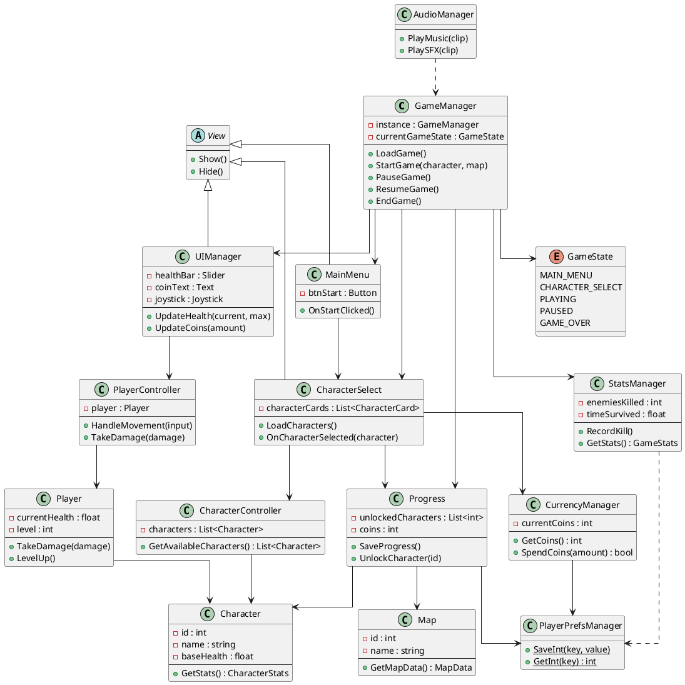

# MAGIC SURVIVORS - CLASS DIAGRAM

> **Sơ đồ class tổng quan cho hệ thống Magic Survivors**
> Bao gồm View, Controller, Entity và các mối quan hệ

---

## Sơ đồ Class Tổng Quan

---

## Hướng Dẫn Sử Dụng

**Import vào PlantUML:**

- **Online Editor:** http://www.plantuml.com/plantuml/uml/
- **VS Code:** Cài extension "PlantUML" by jebbs, press `Alt+D` để preview
- **IntelliJ IDEA:** Cài plugin "PlantUML integration"

**Layout:**
- `left to right direction` - Sắp xếp theo chiều ngang
- `skinparam linetype ortho` - Đường thẳng góc vuông
- Các package có màu sắc riêng để dễ phân biệt

**Relationships:**
- `-->` association
- `<|--` inheritance  
- `..|>` implements
- `..>` dependency
