# 📊 TỔNG HỢP USE CASES VÀ SƠ ĐỒ - MAGIC SURVIVORS

> **Magic Survivors - Complete Use Cases and Diagrams**  
> **Tổng hợp từ:** USE_CASES.md, USE_CASE_SPECIFICATIONS.md, SEQUENCE_DIAGRAMS.md, CLASS_DIAGRAM.md  
> **Ngày tạo:** 22/01/2026

---

## 📋 MỤC LỤC

1. [Tổng quan Use Cases](#1-tổng-quan-use-cases)
2. [Sơ đồ Use Case Diagram](#2-sơ-đồ-use-case-diagram)
3. [Đặc tả Use Cases chi tiết](#3-đặc-tả-use-cases-chi-tiết)
4. [Sequence Diagrams](#4-sequence-diagrams)
5. [Class Diagram](#5-class-diagram)
6. [Ma trận liên kết Use Cases](#6-ma-trận-liên-kết-use-cases)

---

## 1. TỔNG QUAN USE CASES

### 🎭 Actors (Tác nhân)

#### **1. Player (Người chơi)**
- Người dùng cuối chơi game

#### **2. System (Hệ thống)**
- Tự động xử lý logic game

### 📊 Danh sách Use Cases

#### **Use Cases tổng quát (8 UC)**

| ID | Tên Use Case | Actor | Mô tả |
|----|--------------|-------|-------|
| UC01 | Quản lý Menu | Player | Player điều hướng và tương tác với các menu trong game |
| UC02 | Chuẩn bị game | Player | Player chọn nhân vật và map trước khi bắt đầu game |
| UC03 | Chơi game | Player | Player điều khiển nhân vật, chiến đấu và sinh tồn trong game |
| UC04 | Quản lý tiến trình | Player | Player nâng cấp nhân vật qua việc chọn upgrades khi level up |
| UC05 | Xem thống kê | Player | Player xem thống kê khi game kết thúc (Victory/Game Over) |
| UC06 | Quản lý entities | System | System tự động spawn và quản lý quái vật, boss, chests |
| UC07 | Xử lý chiến đấu | System | System xử lý combat logic giữa player và monsters |
| UC08 | Xử lý kết thúc game | System | System xử lý logic khi game kết thúc (thắng/thua) |

#### **Use Cases chi tiết (17 UC)**

| ID | Tên Use Case | Actor | Mức độ ưu tiên |
|----|--------------|-------|----------------|
| UC01 | Khởi động game và vào Main Menu | Player | Bắt buộc |
| UC02 | Điều chỉnh âm lượng | Player | Trung bình |
| UC03 | Điều chỉnh điều khiển | Player | Trung bình |
| UC04 | Tùy chỉnh vị trí UI | Player | Thấp |
| UC05 | Thoát game | Player | Bắt buộc |
| UC06 | Chọn nhân vật và xem thông tin | Player | Bắt buộc |
| UC07 | Mua/Mở khóa nhân vật | Player | Trung bình |
| UC08 | Chọn map để chơi | Player | Bắt buộc |
| UC09 | Di chuyển nhân vật | Player | Bắt buộc |
| UC10 | Tạm dừng game | Player | Bắt buộc |
| UC11 | Tiếp tục game | Player | Bắt buộc |
| UC12 | Thoát về menu | Player | Bắt buộc |
| UC13 | Chọn upgrade khi level up | Player | Bắt buộc |
| UC14 | Xem Achievements | Player | Thấp |
| UC15 | Xem Collection | Player | Thấp |
| UC16 | Restart game sau khi kết thúc | Player | Bắt buộc |
| UC17 | Quay về Main Menu sau khi kết thúc game | Player | Bắt buộc |

---

## 2. SƠ ĐỒ USE CASE DIAGRAM

### Use Case Diagram Tổng Quát

```
┌─────────────────────────────────────────────────────────────┐
│                      VAMPIRE SURVIVORS                      │
├─────────────────────────────────────────────────────────────┤
│                                                             │
│  Player                                                     │
│    │                                                        │
│    ├──[UC01] Quản lý Menu                                 │
│    ├──[UC02] Chuẩn bị game                                │
│    ├──[UC03] Chơi game                                    │
│    ├──[UC04] Quản lý tiến trình                           │
│    └──[UC05] Xem thống kê                                 │
│                                                             │
│  System                                                     │
│    │                                                        │
│    ├──[UC06] Quản lý entities                             │
│    ├──[UC07] Xử lý chiến đấu                              │
│    └──[UC08] Xử lý kết thúc game                          │
│                                                             │
└─────────────────────────────────────────────────────────────┘
```

### Use Case Diagram Chi Tiết

```
┌─────────────────────────────────────────────────────────┐
│                  MAGIC SURVIVORS GAME                   │
├─────────────────────────────────────────────────────────┤
│                                                         │
│  👤 Player                                              │
│     │                                                   │
│     ├─── [UC01] Khởi động game                        │
│     ├─── [UC02] Điều chỉnh âm lượng                   │
│     ├─── [UC03] Điều chỉnh điều khiển                 │
│     ├─── [UC04] Tùy chỉnh vị trí UI                   │
│     ├─── [UC05] Thoát game                            │
│     │                                                   │
│     ├─── [UC06] Chọn nhân vật & xem thông tin         │
│     ├─── [UC07] Mua/Mở khóa nhân vật                  │
│     ├─── [UC08] Chọn map                              │
│     │                                                   │
│     ├─── [UC09] Di chuyển nhân vật                    │
│     ├─── [UC10] Tạm dừng game                         │
│     ├─── [UC11] Tiếp tục game                         │
│     ├─── [UC12] Thoát về menu                         │
│     │                                                   │
│     ├─── [UC13] Chọn upgrade khi level up             │
│     │                                                   │
│     ├─── [UC14] Xem Achievements                      │
│     ├─── [UC15] Xem Collection                        │
│     │                                                   │
│     ├─── [UC16] Restart game sau khi kết thúc         │
│     └─── [UC17] Quay về Main Menu sau kết thúc        │
│                                                         │
└─────────────────────────────────────────────────────────┘
```

---

## 3. ĐẶC TẢ USE CASES CHI TIẾT

### A. Menu & Navigation

---

#### **UC01 - Khởi động game và vào Main Menu**

| Mục | Nội dung |
|-----|----------|
| **UC ID** | UC01 |
| **Tên UC** | Khởi động game và vào Main Menu |
| **Mô tả** | Người chơi khởi động game và vào màn hình menu chính để truy cập các chức năng của game |
| **Actor** | Player (Người chơi) |
| **Mức độ ưu tiên** | Bắt buộc |
| **Tiền điều kiện** | • Game đã được cài đặt trên thiết bị<br>• Thiết bị đáp ứng yêu cầu cấu hình tối thiểu |
| **Luồng chính** | 1. Người chơi click vào icon game để khởi động<br>2. Hệ thống load các resources cần thiết<br>3. Hệ thống hiển thị Main Menu với các options:<br>&nbsp;&nbsp;&nbsp;• Start (Bắt đầu chơi)<br>&nbsp;&nbsp;&nbsp;• Achievements (Thành tích)<br>&nbsp;&nbsp;&nbsp;• Collection (Bộ sưu tập)<br>&nbsp;&nbsp;&nbsp;• Settings (Cài đặt)<br>&nbsp;&nbsp;&nbsp;• Exit (Thoát game)<br>4. Người chơi có thể chọn bất kỳ option nào |
| **Luồng thay thế** | • 2a. Nếu lần đầu khởi động game, hệ thống sẽ khởi tạo dữ liệu mặc định (coins = 0, unlocked characters, etc.)<br>• 2b. Nếu thiếu resources, hiển thị lỗi "Missing files" |
| **Hậu điều kiện** | Main Menu được hiển thị thành công, người chơi có thể truy cập các chức năng |
| **File liên quan** | `MainMenu.cs` |

---

#### **UC02 - Điều chỉnh âm lượng**

| Mục | Nội dung |
|-----|----------|
| **UC ID** | UC02 |
| **Tên UC** | Điều chỉnh âm lượng |
| **Mô tả** | Người chơi có thể điều chỉnh âm lượng nhạc nền (Music) và hiệu ứng âm thanh (SFX) |
| **Actor** | Player (Người chơi) |
| **Mức độ ưu tiên** | Trung bình |
| **Tiền điều kiện** | • Đã vào Main Menu (UC01) |
| **Luồng chính** | 1. Người chơi chọn "Settings" từ Main Menu<br>2. Hệ thống hiển thị Settings Panel với 2 slider:<br>&nbsp;&nbsp;&nbsp;• Music Volume (Âm lượng nhạc nền)<br>&nbsp;&nbsp;&nbsp;• SFX Volume (Âm lượng hiệu ứng)<br>3. Người chơi kéo slider để điều chỉnh âm lượng mong muốn<br>4. Hệ thống cập nhật âm lượng real-time<br>5. Người chơi click "Back" để quay về Main Menu |
| **Luồng thay thế** | • 3a. Người chơi có thể mute hoàn toàn bằng cách kéo slider về 0<br>• 5a. Nếu không click "Back", settings vẫn được lưu tự động |
| **Hậu điều kiện** | Âm lượng được điều chỉnh và lưu vào PlayerPrefs, áp dụng cho toàn bộ game |
| **File liên quan** | `AudioManager.cs`, `AudioSettings.cs` |

---

#### **UC03 - Điều chỉnh điều khiển**

| Mục | Nội dung |
|-----|----------|
| **UC ID** | UC03 |
| **Tên UC** | Điều chỉnh điều khiển |
| **Mô tả** | Người chơi có thể điều chỉnh loại joystick (cố định, di động, cố định khi chạm) để phù hợp với thói quen chơi |
| **Actor** | Player (Người chơi) |
| **Mức độ ưu tiên** | Trung bình |
| **Tiền điều kiện** | • Đã vào Main Menu (UC01) |
| **Luồng chính** | 1. Người chơi chọn "Settings" từ Main Menu<br>2. Hệ thống hiển thị Settings Panel<br>3. Người chơi chọn tab "Controls"<br>4. Hệ thống hiển thị các tùy chọn điều khiển:<br>&nbsp;&nbsp;&nbsp;• Floating: Joystick di chuyển theo ngón tay<br>&nbsp;&nbsp;&nbsp;• Fixed: Joystick cố định tại vị trí<br>&nbsp;&nbsp;&nbsp;• Fixed On Touch: Joystick xuất hiện tại chỗ chạm<br>5. Người chơi chọn loại joystick mong muốn<br>6. Hệ thống lưu cài đặt vào PlayerPrefs<br>7. Người chơi click "Back" để quay về Main Menu |
| **Luồng thay thế** | • 5a. Người chơi có thể test joystick ngay trong Settings bằng preview area<br>• 6a. Cài đặt được áp dụng ngay lập tức, không cần restart game |
| **Hậu điều kiện** | Loại joystick được thay đổi và lưu, áp dụng cho tất cả các lần chơi sau |
| **File liên quan** | `JoystickSettings.cs`, `TouchJoystick.cs` |

---

#### **UC04 - Tùy chỉnh vị trí UI**

| Mục | Nội dung |
|-----|----------|
| **UC ID** | UC04 |
| **Tên UC** | Tùy chỉnh vị trí UI |
| **Mô tả** | Người chơi có thể di chuyển và tùy chỉnh vị trí các UI elements trong game (joystick, buttons vật phẩm) để phù hợp với tay cầm |
| **Actor** | Player (Người chơi) |
| **Mức độ ưu tiên** | Thấp |
| **Tiền điều kiện** | • Đã vào Main Menu (UC01) |
| **Luồng chính** | 1. Người chơi chọn "Settings" từ Main Menu<br>2. Hệ thống hiển thị Settings Panel<br>3. Người chơi chọn "Customize UI Layout"<br>4. Hệ thống chuyển sang UI Customization Mode, hiển thị:<br>&nbsp;&nbsp;&nbsp;• Preview màn hình game với các UI elements<br>&nbsp;&nbsp;&nbsp;• Joystick (điều khiển di chuyển)<br>&nbsp;&nbsp;&nbsp;• Item buttons (Bomb, Magnet, Health Potion, etc.)<br>5. Người chơi drag & drop các UI elements để di chuyển đến vị trí mong muốn<br>6. Người chơi click "Save" để lưu layout<br>7. Hệ thống lưu vị trí của từng UI element vào PlayerPrefs<br>8. Hệ thống quay về Settings |
| **Luồng thay thế** | • 6a. Người chơi click "Reset to Default" → Tất cả UI về vị trí mặc định<br>• 6b. Người chơi click "Cancel" → Hủy thay đổi, giữ nguyên layout cũ |
| **Hậu điều kiện** | Vị trí UI được lưu và áp dụng trong game |
| **File liên quan** | `UILayoutCustomizer.cs`, `DraggableUI.cs` |

---

#### **UC05 - Thoát game**

| Mục | Nội dung |
|-----|----------|
| **UC ID** | UC05 |
| **Tên UC** | Thoát game |
| **Mô tả** | Người chơi thoát khỏi game |
| **Actor** | Player (Người chơi) |
| **Mức độ ưu tiên** | Bắt buộc |
| **Tiền điều kiện** | • Đang ở Main Menu |
| **Luồng chính** | 1. Người chơi chọn "Exit" từ Main Menu<br>2. Hệ thống hiển thị dialog xác nhận "Are you sure you want to quit?"<br>3. Người chơi chọn "Yes"<br>4. Hệ thống lưu dữ liệu hiện tại (nếu có)<br>5. Game đóng lại |
| **Luồng thay thế** | • 3a. Người chơi chọn "No" → Quay về Main Menu, không thoát game |
| **Hậu điều kiện** | Game được đóng, dữ liệu được lưu |
| **File liên quan** | `MainMenu.cs` |

---

### B. Character & Map Selection

---

#### **UC06 - Chọn nhân vật và xem thông tin**

| Mục | Nội dung |
|-----|----------|
| **UC ID** | UC06 |
| **Tên UC** | Chọn nhân vật và xem thông tin |
| **Mô tả** | Người chơi chọn nhân vật để chơi và xem thông tin chi tiết về stats của nhân vật đó |
| **Actor** | Player (Người chơi) |
| **Mức độ ưu tiên** | Bắt buộc |
| **Tiền điều kiện** | • Đã click "Start" từ Main Menu |
| **Luồng chính** | 1. Hệ thống hiển thị Character Selection Screen với danh sách các nhân vật<br>2. Người chơi click vào nhân vật muốn chọn<br>3. Hệ thống hiển thị thông tin chi tiết của nhân vật:<br>&nbsp;&nbsp;&nbsp;• Tên nhân vật<br>&nbsp;&nbsp;&nbsp;• Hình ảnh nhân vật<br>&nbsp;&nbsp;&nbsp;• Stats: HP, Speed, Damage, Armor, Recovery<br>&nbsp;&nbsp;&nbsp;• Giá mua (nếu chưa unlock)<br>4. Người chơi xác nhận chọn nhân vật bằng cách click "Select"<br>5. Hệ thống chuyển sang Map Selection Screen |
| **Luồng thay thế** | • 4a. Nếu nhân vật chưa được unlock, button "Select" sẽ đổi thành "Buy" (xem UC07)<br>• 4b. Người chọi click "Back" để quay về Main Menu |
| **Hậu điều kiện** | Nhân vật được chọn, chuyển sang màn hình chọn map |
| **File liên quan** | `CharacterSelector.cs`, `CharacterCard.cs` |

---

#### **UC07 - Mua/Mở khóa nhân vật**

| Mục | Nội dung |
|-----|----------|
| **UC ID** | UC07 |
| **Tên UC** | Mua/Mở khóa nhân vật |
| **Mô tả** | Người chơi sử dụng coins để mua/mở khóa nhân vật mới |
| **Actor** | Player (Người chơi) |
| **Mức độ ưu tiên** | Trung bình |
| **Tiền điều kiện** | • Đang ở Character Selection Screen (UC06)<br>• Chọn nhân vật chưa được unlock<br>• Có đủ coins để mua |
| **Luồng chính** | 1. Người chơi click vào nhân vật bị khóa<br>2. Hệ thống hiển thị thông tin nhân vật và giá mua (bằng coins)<br>3. Người chơi click button "Buy"<br>4. Hệ thống hiển thị dialog xác nhận mua với giá cụ thể<br>5. Người chơi click "Confirm"<br>6. Hệ thống trừ coins và unlock nhân vật<br>7. Hệ thống hiển thị thông báo "Character Unlocked!"<br>8. Button "Buy" đổi thành "Select" |
| **Luồng thay thế** | • 5a. Người chơi click "Cancel" → Hủy giao dịch, quay về Character Selection<br>• 6a. Nếu không đủ coins, hiển thị thông báo "Not enough coins!" và không cho phép mua |
| **Hậu điều kiện** | Nhân vật được unlock, coins bị trừ, có thể chọn nhân vật này để chơi |
| **File liên quan** | `CharacterCard.cs`, `CurrencyManager.cs` |

---

#### **UC08 - Chọn map để chơi**

| Mục | Nội dung |
|-----|----------|
| **UC ID** | UC08 |
| **Tên UC** | Chọn map để chơi |
| **Mô tả** | Người chơi chọn map để bắt đầu game. Mỗi map có độ khó và debuff khác nhau |
| **Actor** | Player (Người chơi) |
| **Mức độ ưu tiên** | Bắt buộc |
| **Tiền điều kiện** | • Đã chọn nhân vật (UC06) |
| **Luồng chính** | 1. Hệ thống hiển thị Map Selection Screen với 5 maps<br>2. Người chơi click vào map muốn chơi<br>3. Hệ thống highlight map được chọn và hiển thị:<br>&nbsp;&nbsp;&nbsp;• Tên map<br>&nbsp;&nbsp;&nbsp;• Hình ảnh preview<br>&nbsp;&nbsp;&nbsp;• Danh sách debuff của map<br>&nbsp;&nbsp;&nbsp;• Trạng thái unlock<br>4. Người chơi click "Start" để bắt đầu<br>5. Hệ thống load game scene với nhân vật và map đã chọn |
| **Luồng thay thế** | • 2a. Nếu map bị khóa (chưa hoàn thành map trước), không cho phép chọn, hiển thị icon khóa<br>• 4a. Người chơi click "Back" để quay về Character Selection |
| **Hậu điều kiện** | Game bắt đầu với nhân vật và map đã chọn, debuff của map được áp dụng |
| **File liên quan** | `MapSelector.cs`, `MapCard.cs`, `LevelManager.cs` |

---

### C. Gameplay

---

#### **UC09 - Di chuyển nhân vật**

| Mục | Nội dung |
|-----|----------|
| **UC ID** | UC09 |
| **Tên UC** | Di chuyển nhân vật |
| **Mô tả** | Người chơi điều khiển nhân vật di chuyển trên map để tránh quái vật và thu thập items |
| **Actor** | Player (Người chơi) |
| **Mức độ ưu tiên** | Bắt buộc |
| **Tiền điều kiện** | • Game đã bắt đầu (UC08 hoàn thành)<br>• Nhân vật còn HP > 0<br>• Game không bị pause |
| **Luồng chính** | 1. Người chơi sử dụng virtual joystick trên màn hình để di chuyển<br>2. Hệ thống xử lý input và di chuyển nhân vật theo hướng tương ứng<br>3. Nhân vật di chuyển với tốc độ theo stat Speed<br>4. Animation di chuyển được phát (nếu có)<br>5. Camera theo dõi nhân vật |
| **Luồng thay thế** | • 2a. Có thể kết hợp nhiều hướng để di chuyển theo đường chéo<br>• 2b. Nếu không chạm joystick, nhân vật đứng yên<br>• 3a. Nếu map có debuff "Reduced Player Speed", tốc độ bị giảm |
| **Hậu điều kiện** | Nhân vật di chuyển đến vị trí mong muốn |
| **File liên quan** | `Character.cs`, `CharacterInput.cs`, `TouchJoystick.cs` |

---

#### **UC10 - Tạm dừng game**

| Mục | Nội dung |
|-----|----------|
| **UC ID** | UC10 |
| **Tên UC** | Tạm dừng game |
| **Mô tả** | Người chơi tạm dừng game để nghỉ hoặc xem thông tin |
| **Actor** | Player (Người chơi) |
| **Mức độ ưu tiên** | Bắt buộc |
| **Tiền điều kiện** | • Đang chơi game (UC09)<br>• Game chưa bị pause |
| **Luồng chính** | 1. Người chơi nhấn nút Pause trên UI<br>2. Hệ thống pause game (Time.timeScale = 0)<br>3. Hệ thống hiển thị Pause Menu với các options:<br>&nbsp;&nbsp;&nbsp;• Resume (Tiếp tục)<br>&nbsp;&nbsp;&nbsp;• Settings (Cài đặt)<br>&nbsp;&nbsp;&nbsp;• Main Menu (Về menu chính)<br>4. Game ngừng hoạt động, chờ người chơi chọn action |
| **Luồng thay thế** | • 1a. Nếu đang trong Upgrade Selection (Level up screen), không cho phép pause |
| **Hậu điều kiện** | Game bị tạm dừng, Pause Menu hiển thị |
| **File liên quan** | `PauseMenu.cs`, `LevelManager.cs` |

---

#### **UC11 - Tiếp tục game**

| Mục | Nội dung |
|-----|----------|
| **UC ID** | UC11 |
| **Tên UC** | Tiếp tục game |
| **Mô tả** | Người chơi tiếp tục game sau khi pause |
| **Actor** | Player (Người chơi) |
| **Mức độ ưu tiên** | Bắt buộc |
| **Tiền điều kiện** | • Game đang bị pause (UC10) |
| **Luồng chính** | 1. Người chơi click "Resume" từ Pause Menu<br>2. Hệ thống đóng Pause Menu<br>3. Hệ thống resume game (Time.timeScale = 1)<br>4. Game tiếp tục từ trạng thái trước khi pause |
| **Luồng thay thế** | • 1a. Người chơi có thể nhấn nút Pause lần nữa để resume thay vì click button |
| **Hậu điều kiện** | Game tiếp tục, Pause Menu bị ẩn |
| **File liên quan** | `PauseMenu.cs` |

---

#### **UC12 - Thoát về menu**

| Mục | Nội dung |
|-----|----------|
| **UC ID** | UC12 |
| **Tên UC** | Thoát về menu |
| **Mô tả** | Người chơi thoát khỏi game đang chơi và quay về Main Menu |
| **Actor** | Player (Người chơi) |
| **Mức độ ưu tiên** | Bắt buộc |
| **Tiền điều kiện** | • Game đang bị pause (UC10) |
| **Luồng chính** | 1. Người chơi click "Main Menu" từ Pause Menu<br>2. Hệ thống hiển thị dialog xác nhận "Exit to Main Menu? Progress will be lost."<br>3. Người chơi click "Yes"<br>4. Hệ thống lưu coins đã thu thập được trong game<br>5. Hệ thống load Main Menu scene<br>6. Hệ thống reset Time.timeScale = 1 |
| **Luồng thay thế** | • 3a. Người chơi click "No" → Hủy thao tác, quay về Pause Menu |
| **Hậu điều kiện** | Quay về Main Menu, tiến trình game hiện tại bị mất (không save game state) |
| **File liên quan** | `PauseMenu.cs`, `MainMenu.cs` |

---

### D. Progression

---

#### **UC13 - Chọn upgrade khi level up**

| Mục | Nội dung |
|-----|----------|
| **UC ID** | UC13 |
| **Tên UC** | Chọn upgrade khi level up |
| **Mô tả** | Khi đạt đủ EXP để level up, người chơi chọn 1 trong 3 upgrade cards (weapon mới, passive mới, hoặc nâng cấp weapon/passive hiện có) |
| **Actor** | Player (Người chơi) |
| **Mức độ ưu tiên** | Bắt buộc |
| **Tiền điều kiện** | • Đang chơi game<br>• Đã thu thập đủ EXP để level up<br>• Hệ thống tự động pause game và hiển thị Upgrade Selection Screen |
| **Luồng chính** | 1. Hệ thống hiển thị 3 upgrade cards ngẫu nhiên, mỗi card có thể là:<br>&nbsp;&nbsp;&nbsp;• Weapon mới (nếu chưa đầy slot)<br>&nbsp;&nbsp;&nbsp;• Passive mới (nếu chưa đầy slot)<br>&nbsp;&nbsp;&nbsp;• Nâng cấp weapon hiện có (tăng level)<br>&nbsp;&nbsp;&nbsp;• Nâng cấp passive hiện có (tăng level)<br>2. Người chơi xem thông tin từng card:<br>&nbsp;&nbsp;&nbsp;• Tên upgrade<br>&nbsp;&nbsp;&nbsp;• Mô tả hiệu ứng<br>&nbsp;&nbsp;&nbsp;• Level hiện tại (nếu đã có)<br>3. Người chơi click chọn 1 card<br>4. Hệ thống áp dụng upgrade được chọn<br>5. Hệ thống đóng Upgrade Selection Screen<br>6. Game tiếp tục (Time.timeScale = 1) |
| **Luồng thay thế** | • 1a. Nếu tất cả weapon và passive đã max level, chỉ hiển thị các upgrade stats cơ bản (HP, Speed, Damage, etc.)<br>• 3a. Người chơi PHẢI chọn, không thể skip hoặc đóng màn hình này |
| **Hậu điều kiện** | Upgrade được áp dụng, game tiếp tục |
| **File liên quan** | `LevelManager.cs`, `AbilitySelectionDialog.cs`, `UpgradeCard.cs` |

---

### E. Meta & Statistics

---

#### **UC14 - Xem Achievements**

| Mục | Nội dung |
|-----|----------|
| **UC ID** | UC14 |
| **Tên UC** | Xem Achievements |
| **Mô tả** | Người chơi xem danh sách các thành tích (achievements) đã đạt được trong game |
| **Actor** | Player (Người chơi) |
| **Mức độ ưu tiên** | Thấp |
| **Tiền điều kiện** | • Đang ở Main Menu |
| **Luồng chính** | 1. Người chơi click "Achievements" từ Main Menu<br>2. Hệ thống hiển thị Achievement Screen với danh sách achievements:<br>&nbsp;&nbsp;&nbsp;• Tên achievement<br>&nbsp;&nbsp;&nbsp;• Mô tả điều kiện đạt được<br>&nbsp;&nbsp;&nbsp;• Trạng thái: Locked/Unlocked<br>&nbsp;&nbsp;&nbsp;• Phần thưởng (nếu có)<br>&nbsp;&nbsp;&nbsp;• Progress bar (VD: Kill 100/500 monsters)<br>3. Người chơi có thể scroll để xem tất cả achievements<br>4. Người chơi click "Back" để quay về Main Menu |
| **Luồng thay thế** | • 2a. Achievements được unlock sẽ tự động cấp phần thưởng (coins) khi đạt được, không cần claim thủ công |
| **Hậu điều kiện** | Người chơi đã xem thông tin achievements |
| **File liên quan** | `AchievementManager.cs`, Achievement UI |

---

#### **UC15 - Xem Collection**

| Mục | Nội dung |
|-----|----------|
| **UC ID** | UC15 |
| **Tên UC** | Xem Collection |
| **Mô tả** | Người chơi xem bộ sưu tập monsters và weapons đã khám phá/gặp trong game |
| **Actor** | Player (Người chơi) |
| **Mức độ ưu tiên** | Thấp |
| **Tiền điều kiện** | • Đang ở Main Menu |
| **Luồng chính** | 1. Người chơi click "Collection" từ Main Menu<br>2. Hệ thống hiển thị Collection Screen với 2 tabs:<br>&nbsp;&nbsp;&nbsp;• Monsters (Quái vật)<br>&nbsp;&nbsp;&nbsp;• Weapons (Vũ khí)<br>3. Người chơi chọn tab muốn xem<br>4. Hệ thống hiển thị danh sách items trong tab đó:<br>&nbsp;&nbsp;&nbsp;• Items đã khám phá: Hiển thị đầy đủ thông tin<br>&nbsp;&nbsp;&nbsp;• Items chưa khám phá: Hiển thị silhouette/???<br>5. Người chơi click vào item để xem chi tiết (nếu đã unlock)<br>6. Người chơi click "Back" để quay về Main Menu |
| **Luồng thay thế** | • 3a. Người chơi có thể switch giữa 2 tabs bất kỳ lúc nào<br>• 5a. Nếu item chưa unlock, không thể xem chi tiết |
| **Hậu điều kiện** | Người chơi đã xem thông tin collection |
| **File liên quan** | `CollectionManager.cs`, Collection UI |

---

### F. Kết thúc game

---

#### **UC16 - Restart game sau khi kết thúc**

| Mục | Nội dung |
|-----|----------|
| **UC ID** | UC16 |
| **Tên UC** | Restart game sau khi kết thúc |
| **Mô tả** | Sau khi kết thúc game (thắng hoặc thua), người chơi chọn chơi lại với cùng nhân vật và map |
| **Actor** | Player (Người chơi) |
| **Mức độ ưu tiên** | Bắt buộc |
| **Tiền điều kiện** | • Game đã kết thúc với 1 trong 2 trường hợp:<br>&nbsp;&nbsp;&nbsp;- **Thua:** Nhân vật chết (HP = 0)<br>&nbsp;&nbsp;&nbsp;- **Thắng:** Đánh bại Final Boss<br>• Đang ở Game Over Screen |
| **Luồng chính** | 1. Hệ thống hiển thị Game Over Screen với:<br>&nbsp;&nbsp;&nbsp;• Kết quả: Victory hoặc Defeat<br>&nbsp;&nbsp;&nbsp;• Thống kê: Thời gian sống sót, Số quái giết, Coins, Level<br>&nbsp;&nbsp;&nbsp;• Buttons: "Restart" và "Main Menu"<br>2. Người chơi click "Restart"<br>3. Hệ thống lưu coins đã thu thập được vào PlayerPrefs<br>4. Hệ thống reload game scene với cùng nhân vật và map đã chọn trước đó<br>5. Game bắt đầu lại từ đầu với trạng thái ban đầu |
| **Luồng thay thế** | • 1a. Nếu thắng và unlock map mới, hiển thị thông báo "New Map Unlocked!"<br>• 1b. Nếu đạt được achievements mới, hiển thị popup thông báo |
| **Hậu điều kiện** | Game bắt đầu lại từ đầu với cùng nhân vật và map, coins được lưu |
| **File liên quan** | `GameOverDialog.cs`, `LevelManager.cs`, `StatsManager.cs` |

---

#### **UC17 - Quay về Main Menu sau khi kết thúc game**

| Mục | Nội dung |
|-----|----------|
| **UC ID** | UC17 |
| **Tên UC** | Quay về Main Menu sau khi kết thúc game |
| **Mô tả** | Sau khi kết thúc game (thắng hoặc thua), người chơi chọn quay về Main Menu để chọn nhân vật/map khác hoặc xem các chức năng khác |
| **Actor** | Player (Người chơi) |
| **Mức độ ưu tiên** | Bắt buộc |
| **Tiền điều kiện** | • Game đã kết thúc với 1 trong 2 trường hợp:<br>&nbsp;&nbsp;&nbsp;- **Thua:** Nhân vật chết (HP = 0)<br>&nbsp;&nbsp;&nbsp;- **Thắng:** Đánh bại Final Boss<br>• Đang ở Game Over Screen |
| **Luồng chính** | 1. Hệ thống hiển thị Game Over Screen với:<br>&nbsp;&nbsp;&nbsp;• Kết quả: Victory hoặc Defeat<br>&nbsp;&nbsp;&nbsp;• Thống kê: Thời gian sống sót, Số quái giết, Coins, Level<br>&nbsp;&nbsp;&nbsp;• Buttons: "Restart" và "Main Menu"<br>2. Người chơi click "Main Menu"<br>3. Hệ thống lưu coins đã thu thập được vào PlayerPrefs<br>4. Hệ thống load Main Menu scene<br>5. Hệ thống reset Time.timeScale = 1<br>6. Main Menu hiển thị với các options như UC01 |
| **Luồng thay thế** | • 1a. Nếu thắng và unlock map mới, hiển thị thông báo "New Map Unlocked!"<br>• 1b. Nếu đạt được achievements mới, hiển thị popup thông báo |
| **Hậu điều kiện** | Quay về Main Menu, coins được lưu, có thể chọn nhân vật/map khác hoặc xem stats |
| **File liên quan** | `GameOverDialog.cs`, `MainMenu.cs`, `StatsManager.cs` |

---

## 4. SEQUENCE DIAGRAMS

### 1. Khởi động game và Main Menu (UC01)

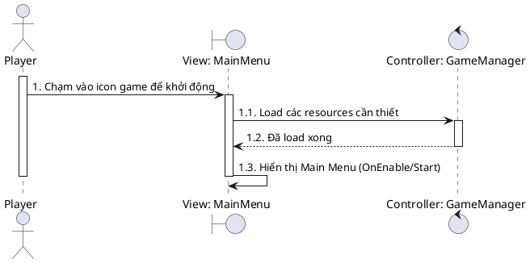

---

### 2. Settings - Điều chỉnh Audio (UC02)

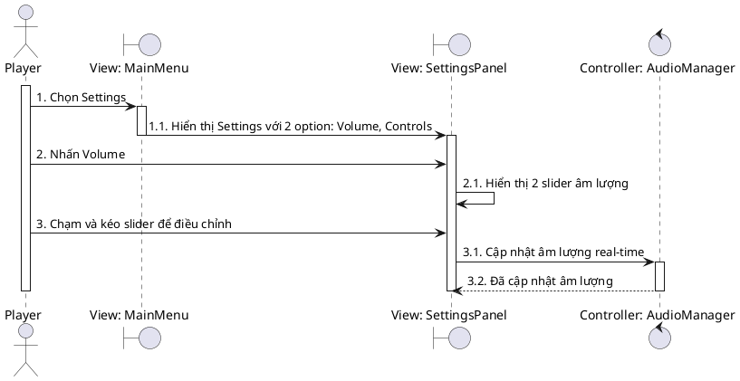

---

### 3. Settings - Điều chỉnh Controls (UC03)

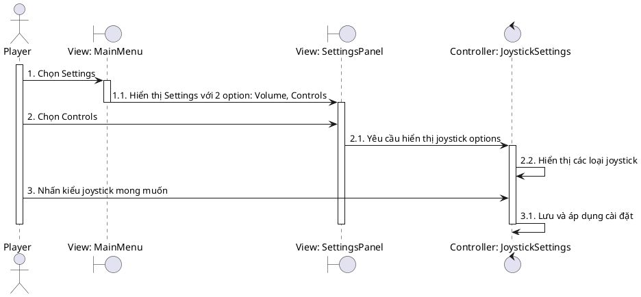

---

### 4. Settings - Tùy chỉnh UI Layout (UC04)

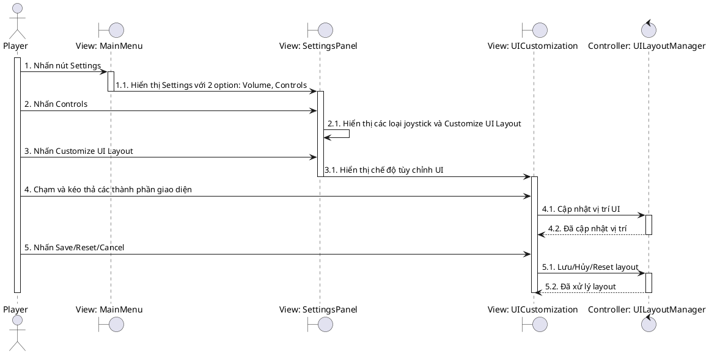

---

### 5. Chọn nhân vật và xem thông tin (UC06)

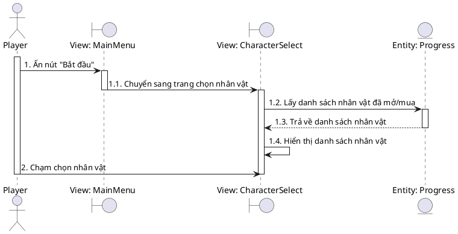

---

### 6. Mua/Mở khóa nhân vật (UC07)

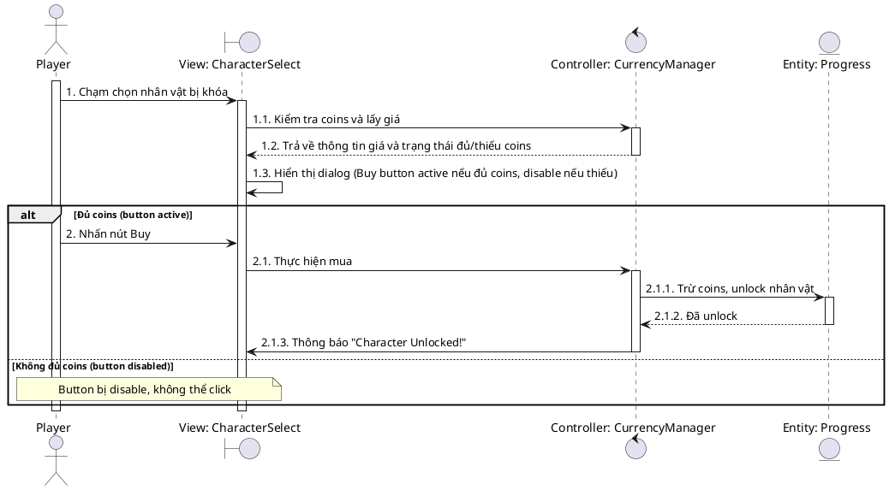

---

### 7. Chọn map để chơi (UC08)

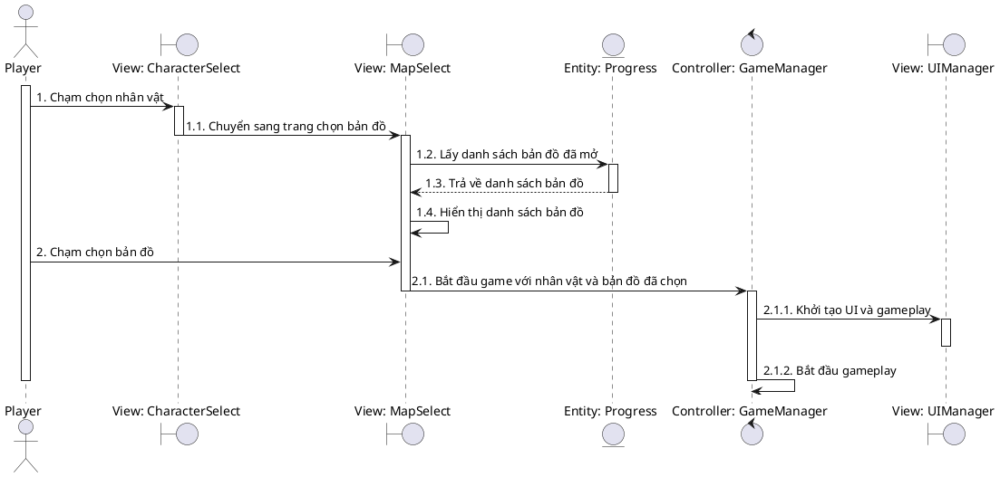

---

### 8. Di chuyển nhân vật (UC09)

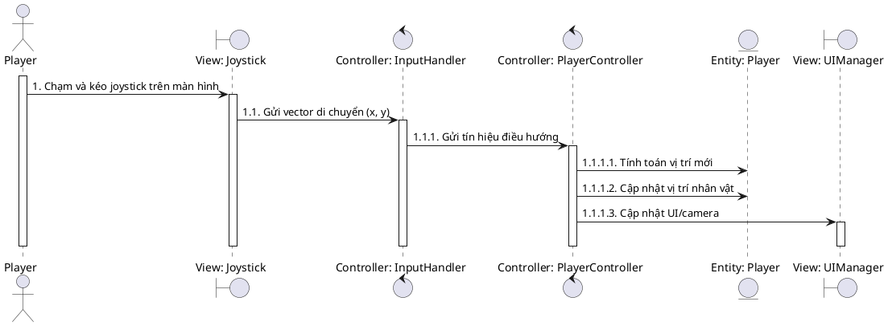

---

### 9. Tạm dừng game (UC10)

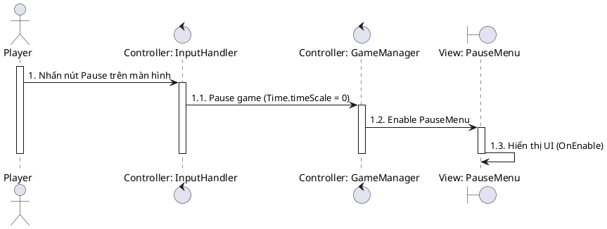

---

### 10. Tiếp tục game (UC11)

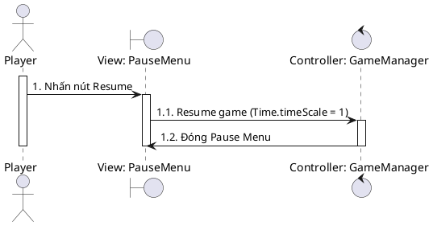

---

### 11. Thoát về menu (UC12)

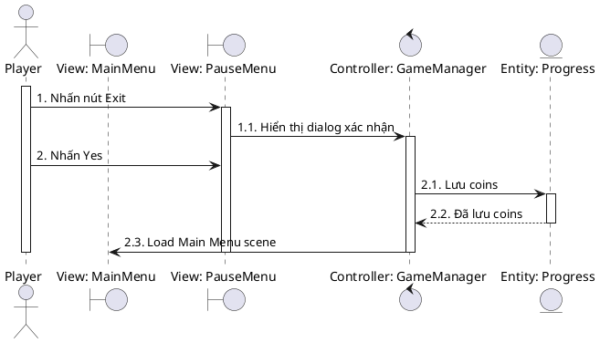

---

### 12. Chọn upgrade khi level up (UC13)

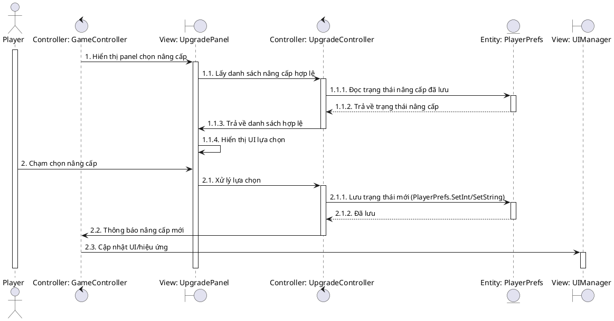

---

### 13. Xem Achievements (UC14)

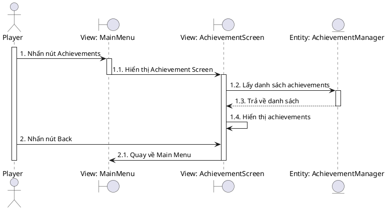

---

### 14. Xem Collection (UC15)

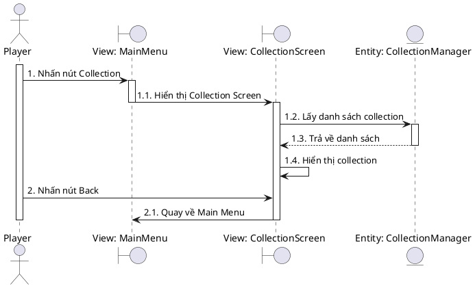

---

### 15. Restart game sau khi kết thúc (UC16)

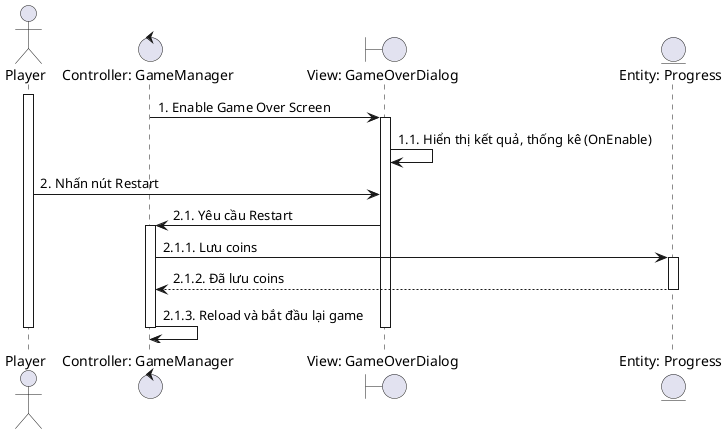

---

### 16. Quay về Main Menu sau khi kết thúc game (UC17)

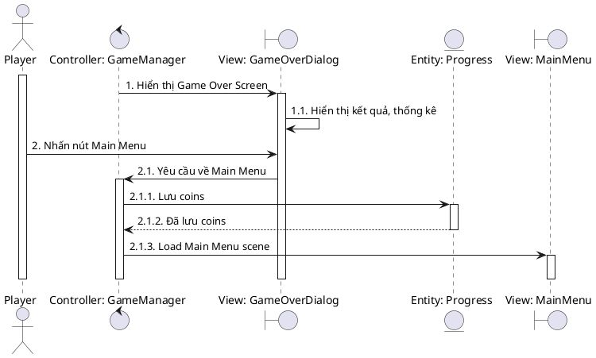

---

## 5. CLASS DIAGRAM

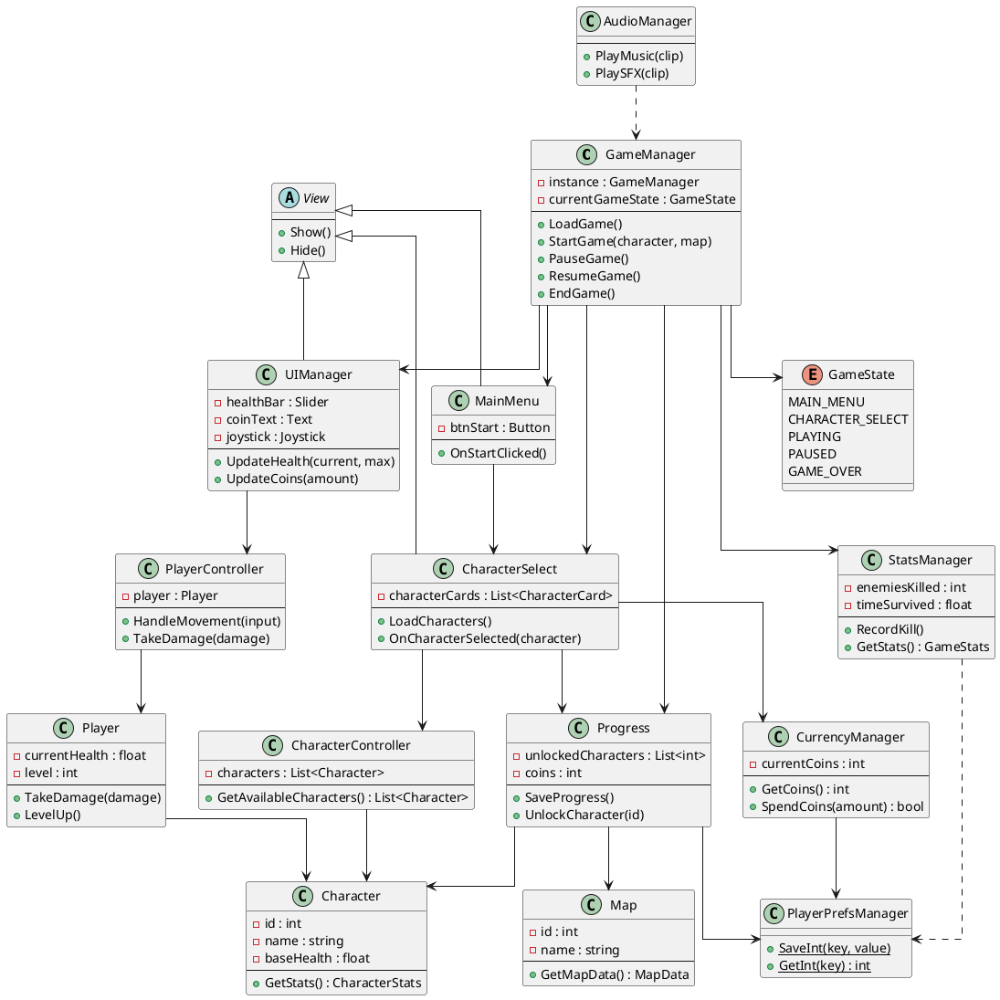

---

## 6. MA TRẬN LIÊN KẾT USE CASES

### Quan hệ Include

- **UC02 (Chuẩn bị game)** includes:
  - Chọn nhân vật
  - Mua nhân vật (nếu cần)
  - Chọn map

- **UC03 (Chơi game)** includes:
  - Điều khiển nhân vật
  - Chiến đấu
  - Thu thập items
  - Pause game

- **UC08 (Xử lý kết thúc)** includes:
  - Lưu tiến trình (coins, map completion)
  - Check achievements
  - Track collection

### Quan hệ Extend

- **UC04 (Quản lý tiến trình)** extends **UC03 (Chơi game)** khi level up
- **UC05 (Xem thống kê)** extends **UC03 (Chơi game)** khi kết thúc

### Ma trận phụ thuộc

| Use Case | Phụ thuộc vào | Kích hoạt |
|----------|---------------|-----------|
| UC01 | - | UC02, UC03, UC04, UC05, UC06, UC14, UC15 |
| UC02 | UC01 | - |
| UC03 | UC01 | - |
| UC04 | UC01 | - |
| UC05 | UC01 | - |
| UC06 | UC01 | UC07, UC08 |
| UC07 | UC06 | - |
| UC08 | UC06 | UC09 |
| UC09 | UC08 | UC10 |
| UC10 | UC09 | UC11, UC12 |
| UC11 | UC10 | UC09 |
| UC12 | UC10 | UC01 |
| UC13 | UC09 (Level up event) | - |
| UC14 | UC01 | - |
| UC15 | UC01 | - |
| UC16 | Game End Event | UC08 |
| UC17 | Game End Event | UC01 |

---

## 📝 GHI CHÚ

### Các hành động tự động của hệ thống (KHÔNG phải Use Case):
- Thu thập items tự động khi chạm vào (EXP gems, coins, health potions, etc.)
- Weapons tự động tấn công quái vật
- Spawn quái vật theo wave
- Level up tự động khi đủ EXP (nhưng việc chọn upgrade là UC13)
- Lưu game tự động (auto-save)
- Hiển thị Game Over khi chết (nhưng việc chọn Restart/Menu là UC16/UC17)
- Boss xuất hiện tự động sau 10 phút
- Achievements unlock tự động và claim rewards tự động

### Lý do không đưa vào Use Case:
- Những hành động này không yêu cầu **tương tác chủ động** từ người chơi
- Chúng là các **cơ chế tự động** của game engine/system
- Use Case chỉ đặc tả những gì **người chơi có quyền quyết định và thực hiện**

---

## 🎯 TỔNG KẾT

- **Tổng số Use Cases:** 17 (chi tiết) / 8 (tổng quát)
- **Use Cases của Player:** 17 (chi tiết) / 5 (tổng quát)
- **Use Cases của System:** 0 (chi tiết) / 3 (tổng quát)
- **Include relationships:** 3 groups
- **Extend relationships:** 2
- **Dependencies:** 17 cặp

### Đặc điểm

✅ **Tập trung vào chức năng chính**  
✅ **Dễ vẽ sơ đồ Use Case UML**  
✅ **Bao quát toàn bộ game flow**  
✅ **Phù hợp cho tài liệu phân tích**  
✅ **Có cả version tổng quát và chi tiết**

---

**📊 Use Cases và Diagrams hoàn chỉnh cho Magic Survivors**

File này tổng hợp tất cả các Use Cases (cả tổng quát và chi tiết), Sequence Diagrams, và Class Diagram cho dự án Magic Survivors. Sử dụng PlantUML để render các sơ đồ sequence và class diagram.

**Hướng dẫn sử dụng PlantUML:**
- **Online Editor:** http://www.plantuml.com/plantuml/uml/
- **VS Code:** Cài extension "PlantUML" by jebbs, press `Alt+D` để preview
- **IntelliJ IDEA:** Cài plugin "PlantUML integration"
