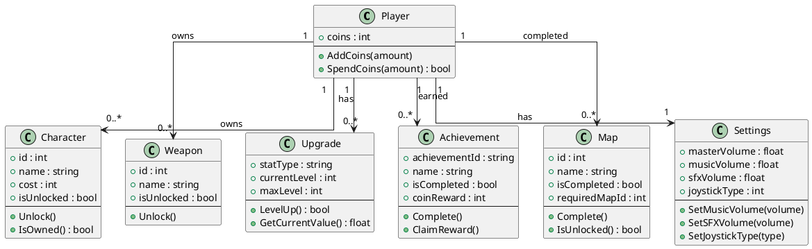
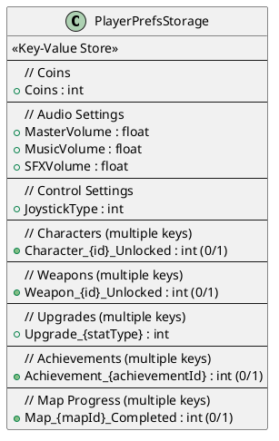

---

# CHƯƠNG 6: KẾT LUẬN VÀ HƯỚNG PHÁT TRIỂN

## 1. Kết luận

Sau quá trình nghiên cứu và phát triển đề tài “Game Magic Survivors – Unity 2D”, em đã hoàn thành hầu hết các mục tiêu đặt ra ban đầu. Đề tài tập trung xây dựng một game sinh tồn với lối chơi cuốn hút, hệ thống nâng cấp đa dạng, lưu trữ tiến trình bằng PlayerPrefs, giao diện trực quan và khả năng mở rộng tốt trên nền tảng Unity.

Trong quá trình thực hiện, em đã trải qua đầy đủ các giai đoạn phát triển phần mềm game thực tế: khảo sát ý tưởng, phân tích yêu cầu gameplay, thiết kế hệ thống dữ liệu, lập trình các hệ thống cốt lõi, xây dựng giao diện người dùng, kiểm thử và hoàn thiện sản phẩm.

Cụ thể, các kết quả đạt được gồm:
- Hoàn thiện cấu trúc hệ thống: Thiết kế mô hình dữ liệu logic, sơ đồ class, sơ đồ lưu trữ PlayerPrefs, xây dựng các class quản lý (Character, UpgradeManager, CoinManager, SettingsManager, MapDebuffManager, AchievementManager, AudioManager, v.v.).
- Xây dựng các module chính: Điều khiển nhân vật, quản lý nâng cấp, quản lý coin, quản lý debuff bản đồ, achievement, hệ thống âm thanh, các panel UI (Pause, Settings, GameOver, Achievement, Ability Selection, v.v.).
- Lưu trữ tiến trình và thiết lập: Sử dụng PlayerPrefs để lưu trạng thái mở khóa, nâng cấp, coin, thiết lập âm thanh, điều khiển, achievement, đảm bảo dữ liệu ổn định và dễ kiểm thử.
- Thiết kế giao diện trực quan: Xây dựng các panel UI, tối ưu trải nghiệm người chơi, hỗ trợ thao tác nhanh và hiển thị thông tin rõ ràng.
- Kiểm thử và tối ưu: Thực hiện kiểm thử chức năng, kiểm tra hiệu năng khi số lượng enemy tăng cao, kiểm tra lưu/đọc dữ liệu PlayerPrefs, đảm bảo game hoạt động ổn định trên nhiều nền tảng.
- Áp dụng quy trình phát triển phần mềm chuyên nghiệp: Từ phân tích, thiết kế, lập trình, kiểm thử đến hoàn thiện tài liệu và hướng dẫn sử dụng.

## 2. Hướng phát triển

Để nâng cao chất lượng và mở rộng tính năng cho game Magic Survivors, trong tương lai có thể phát triển theo các hướng sau:

### Hoàn thiện và mở rộng gameplay
- Bổ sung nhiều loại enemy, boss với AI đa dạng, tăng thử thách cho người chơi.
- Thêm nhiều loại vũ khí, kỹ năng đặc biệt, hệ thống nâng cấp sâu hơn.
- Xây dựng hệ thống nhiệm vụ (quest), phần thưởng hàng ngày, bảng xếp hạng online.
- Mở rộng achievement, hệ thống thành tựu nâng cao.

### Tối ưu hiệu năng và trải nghiệm
- Tối ưu hóa thuật toán spawn enemy, xử lý va chạm, quản lý object pool để giảm tải cho CPU.
- Cải thiện UI/UX, bổ sung hướng dẫn tương tác, hiệu ứng hình ảnh và âm thanh sống động hơn.
- Hỗ trợ nhiều độ phân giải, tối ưu cho cả PC và mobile.

### Kết nối và mở rộng nền tảng
- Phát triển phiên bản mobile (Android/iOS), đồng bộ tiến trình qua cloud.
- Tích hợp bảng xếp hạng online, lưu trữ dữ liệu người chơi trên server.
- Hỗ trợ nhiều ngôn ngữ, mở rộng thị trường quốc tế.

### Tăng cường kiểm thử và bảo mật
- Xây dựng bộ kiểm thử tự động cho các hệ thống quan trọng (nâng cấp, achievement, lưu trữ).
- Bổ sung cơ chế backup/restore dữ liệu, hạn chế gian lận khi chỉnh sửa PlayerPrefs.

## 3. Kết luận chung

Đề tài “Game Magic Survivors – Unity 2D” không chỉ đạt được các mục tiêu về gameplay, kỹ thuật lưu trữ và giao diện, mà còn giúp người thực hiện rèn luyện kỹ năng phân tích, thiết kế, lập trình và kiểm thử một sản phẩm game thực tế trên nền tảng Unity.

Việc vận dụng các công nghệ hiện đại như Unity, C#, ScriptableObject, PlayerPrefs, cùng quy trình phát triển phần mềm chuyên nghiệp đã mang lại một mô hình game linh hoạt, dễ mở rộng, phù hợp với xu hướng phát triển game indie hiện nay.

Thông qua quá trình thực hiện, em đã rèn luyện được:
- Kỹ năng nghiên cứu, tự học và giải quyết vấn đề thực tế trong phát triển game.
- Tư duy logic, thiết kế hệ thống dữ liệu, tối ưu hiệu năng và trải nghiệm người dùng.
- Kỹ năng kiểm thử, hoàn thiện tài liệu và hướng dẫn sử dụng sản phẩm.

Trong tương lai, việc tiếp tục hoàn thiện và phát triển game Magic Survivors sẽ góp phần tạo ra một sản phẩm giải trí hấp dẫn, có khả năng thương mại hóa và mở rộng cộng đồng người chơi.

---

# TÀI LIỆU THAM KHẢO

[1] Unity Technologies, "Unity Manual & Scripting API," 2025. [Online]. Available: https://docs.unity3d.com/Manual/index.html
[2] Unity Technologies, "Unity Learn - Game Development Tutorials," 2025. [Online]. Available: https://learn.unity.com/
# MAGIC SURVIVORS - LOGICAL DATA MODEL

> **Mô hình dữ liệu logic sử dụng Unity PlayerPrefs**
> Cấu trúc lưu trữ persistent data cho game Magic Survivors

---

## Giới Thiệu PlayerPrefs

**PlayerPrefs** là hệ thống lưu trữ key-value của Unity cho phép lưu dữ liệu đơn giản giữa các phiên chơi. 

**Đặc điểm:**
- Lưu trữ theo cặp key-value
- Hỗ trợ **3 kiểu dữ liệu**: `int`, `float`, `string`
- Dữ liệu được lưu tự động trên thiết bị
- Phù hợp cho settings, progress, coins, unlocks
- **Không mã hóa** - không dùng cho dữ liệu nhạy cảm

**⚠️ Lưu ý về cách lưu trữ hiện tại:**

**Cách bạn đang làm (Multiple Keys):**
- ✅ **Ưu điểm:** Đơn giản, dễ implement, không cần JSON
- ❌ **Nhược điểm:** Tạo nhiều key, khó list tất cả unlocks

**Ví dụ:**
```csharp
// Unlock character 5
PlayerPrefs.SetInt("Character_5_Unlocked", 1);

// Check if character 5 is unlocked
bool isUnlocked = PlayerPrefs.GetInt("Character_5_Unlocked", 0) == 1;

// Vấn đề: Làm sao biết có bao nhiêu characters đã unlock?
// → Phải check từng ID một: Character_1, Character_2, Character_3...
```

**Nếu muốn list tất cả unlocked characters:**
→ Phải dùng JSON (như phần Ví dụ code bên dưới)

**Vị trí lưu trữ:**
- **Windows:** Registry tại `HKEY_CURRENT_USER\Software\[CompanyName]\[ProductName]`
- **Android:** `/data/data/pkg-name/shared_prefs/pkg-name.xml`
- **iOS:** `/Library/Preferences/[bundle identifier].plist`

---

## Sơ Đồ Logical Data Model



---

## Sơ Đồ Physical Storage (PlayerPrefs)



---

## Bảng Key-Value Chi Tiết

### 1. Coins

| Key | Type | Default | Description |
|-----|------|---------|-------------|
| `Coins` | int | 0 | Số coins hiện tại của người chơi |

### 2. Audio Settings

| Key | Type | Default | Description |
|-----|------|---------|-------------|
| `MasterVolume` | float | 1.0 | Âm lượng tổng (0.0 - 1.0) |
| `MusicVolume` | float | 1.0 | Âm lượng nhạc nền (0.0 - 1.0) |
| `SFXVolume` | float | 1.0 | Âm lượng hiệu ứng âm thanh (0.0 - 1.0) |

### 3. Control Settings

| Key | Type | Default | Description |
|-----|------|---------|-------------|
| `JoystickType` | int | 0 | Loại joystick (0=Fixed, 1=Floating, 2=Dynamic) |

### 4. Character Unlocks (Multiple Keys)

| Key Pattern | Type | Default | Description |
|-----|------|---------|-------------|
| `Character_{id}_Unlocked` | int | 0 | Nhân vật ID đã mở (0=locked, 1=unlocked) |

### 5. Weapon Unlocks (Multiple Keys)

| Key Pattern | Type | Default | Description |
|-----|------|---------|-------------|
| `Weapon_{id}_Unlocked` | int | 0 | Vũ khí ID đã mở (0=locked, 1=unlocked) |

### 6. Upgrades (Multiple Keys)

| Key Pattern | Type | Default | Description |
|-----|------|---------|-------------|
| `Upgrade_{statType}` | int | 0 | Level của upgrade (MaxHealth, MoveSpeed, etc) |

### 7. Achievements (Multiple Keys)

| Key Pattern | Type | Default | Description |
|-----|------|---------|-------------|
| `Achievement_{achievementId}` | int | 0 | Achievement đã hoàn thành (0=not done, 1=completed) |

### 8. Map Progress (Multiple Keys)

| Key Pattern | Type | Default | Description |
|-----|------|---------|-------------|
| `Map_{mapId}_Completed` | int | 0 | Map đã hoàn thành (0=not completed, 1=completed) |

---

## Ví Dụ Code C# Implementation

```csharp
public class PlayerPrefsManager
{
    // Keys constants
    private const string COINS_KEY = "player_coins";
    private const string CHARACTER_SELECTED_KEY = "character_selected_id";
    private const string MUSIC_VOLUME_KEY = "settings_music_volume";
    
    // Save methods
    public static void SaveCoins(int coins)
    {
        PlayerPrefs.SetInt(COINS_KEY, coins);
        PlayerPrefs.Save();
    }
    
    public static int GetCoins()
    {
        return PlayerPrefs.GetInt(COINS_KEY, 0);
    }
    
    public static void SaveMusicVolume(float volume)
    {
        PlayerPrefs.SetFloat(MUSIC_VOLUME_KEY, volume);
        PlayerPrefs.Save();
    }
    
    public static float GetMusicVolume()
    {
        return PlayerPrefs.GetFloat(MUSIC_VOLUME_KEY, 1.0f);
    }
    
    // JSON example for complex data
    public static void SaveUnlockedCharacters(List<int> characterIds)
    {
        string json = JsonUtility.ToJson(new IntListWrapper { values = characterIds });
        PlayerPrefs.SetString("character_unlocked_list", json);
        PlayerPrefs.Save();
    }
    
    public static List<int> GetUnlockedCharacters()
    {
        string json = PlayerPrefs.GetString("character_unlocked_list", "[1]");
        IntListWrapper wrapper = JsonUtility.FromJson<IntListWrapper>(json);
        return wrapper.values;
    }
}

[System.Serializable]
public class IntListWrapper
{
    public List<int> values;
}
```

---

## Best Practices

### ✅ Nên Làm:
- Sử dụng constants cho keys để tránh typo
- Gọi `PlayerPrefs.Save()` sau khi set giá trị quan trọng
- Serialize dữ liệu phức tạp thành JSON string
- Provide default values khi GetInt/GetFloat/GetString
- Validate dữ liệu sau khi load

### ❌ Không Nên:
- Lưu password hoặc sensitive data
- Lưu quá nhiều dữ liệu (PlayerPrefs không phải database)
- Gọi Set/Get trong Update() hoặc FixedUpdate()
- Hard-code key strings khắp nơi trong code
- Quên check HasKey() trước khi GetInt/GetFloat

---

## Data Migration Strategy

Khi cần thay đổi cấu trúc dữ liệu:

```csharp
public static void MigrateDataIfNeeded()
{
    int dataVersion = PlayerPrefs.GetInt("data_version", 0);
    
    if (dataVersion < 1)
    {
        // Migration from v0 to v1
        // Example: Rename old key to new key
        if (PlayerPrefs.HasKey("old_coins_key"))
        {
            int coins = PlayerPrefs.GetInt("old_coins_key");
            PlayerPrefs.SetInt("player_coins", coins);
            PlayerPrefs.DeleteKey("old_coins_key");
        }
        dataVersion = 1;
    }
    
    // Save current version
    PlayerPrefs.SetInt("data_version", dataVersion);
    PlayerPrefs.Save();
}
```

---

## Testing & Debugging

### Clear All Data (Development):
```csharp
public static void ClearAllData()
{
    PlayerPrefs.DeleteAll();
    PlayerPrefs.Save();
    Debug.Log("All PlayerPrefs data cleared!");
}
```

### Debug Current Values:
```csharp
public static void DebugPrintAllData()
{
    Debug.Log($"Coins: {GetCoins()}");
    Debug.Log($"Selected Character: {GetInt(CHARACTER_SELECTED_KEY)}");
    Debug.Log($"Music Volume: {GetMusicVolume()}");
    // ... other debug logs
}
```

---

## Notes

- **Performance:** PlayerPrefs đọc/ghi nhanh cho dữ liệu nhỏ
- **Platform:** Works on all Unity platforms (PC, Mobile, WebGL)
- **Limitations:** Không thay thế cho proper database nếu cần query phức tạp
- **Security:** Dữ liệu không được mã hóa, user có thể modify
- **Alternative:** Xem xét JsonUtility + File I/O cho dữ liệu lớn hơn

---

## 4. Khởi tạo dự án

### 4.1. Mục tiêu
Xây dựng đầy đủ các hệ thống cốt lõi cho game Magic Survivors trên Unity, bao gồm: gameplay, điều khiển nhân vật, quản lý kẻ địch, hệ thống nâng cấp, giao diện người dùng (UI), lưu tiến trình bằng PlayerPrefs và âm thanh. Đảm bảo các hệ thống hoạt động ổn định, liên kết chặt chẽ và dễ mở rộng.

### 4.2. Các bước thực hiện

#### 4.2.1. Khởi tạo dự án Unity
1. Tạo project mới trong Unity Hub, chọn template 2D, đặt tên dự án là “Magic Survivors”.

_Hình minh họa: Tạo project mới trong Unity Hub_

2. Thiết lập cấu trúc thư mục trong Assets:
   - Scripts: chứa các script chính (GameManager, PlayerController, EnemyManager, UpgradeManager, AudioManager, UIManager…)
   - Scenes: lưu các scene (MainMenu, CharacterSelect, Gameplay, GameOver…)
   - Prefabs: lưu các prefab (Player, Enemy, Item, UI Panel…)
   - Sprites: lưu hình ảnh nhân vật, kẻ địch, vật phẩm, UI
   - Audio: lưu nhạc nền, hiệu ứng âm thanh
   - Materials, Settings: lưu các file cấu hình, chất liệu

_Hình minh họa: Cấu trúc thư mục Assets trong Unity_

3. Tạo các scene chính: MainMenu, CharacterSelect, Gameplay, GameOver.

_Hình minh họa: Danh sách scene trong Unity Editor_

4. Khởi tạo các GameObject cốt lõi trong scene Gameplay: Player, EnemySpawner, UIManager, AudioManager, Map, UpgradeManager.

_Hình minh họa: Hierarchy các GameObject chính trong scene Gameplay_

5. Cài đặt các package cần thiết từ Unity Package Manager: TextMeshPro (UI nâng cao), Input System (điều khiển), Addressables (quản lý asset).

_Hình minh họa: Cài đặt package trong Unity Package Manager_

6. Tạo ScriptableObject cho cấu hình nhân vật, vũ khí, bản đồ, nâng cấp.

_Hình minh họa: ScriptableObject cấu hình nhân vật_

7. Thiết lập PlayerPrefs cho các giá trị mặc định: âm lượng, điều khiển, tiến trình, trạng thái mở khóa.

_Hình minh họa: Thiết lập giá trị PlayerPrefs mặc định trong Inspector hoặc code_


#### 4.2.2. Xây dựng các hệ thống cốt lõi (tham chiếu đúng file code dự án)
1. Lập trình hệ thống điều khiển nhân vật (Character): di chuyển, tấn công, nhận sát thương, nâng cấp.
  - **Code:** [Assets/Scripts/Character/Character.cs](Assets/Scripts/Character/Character.cs)
  - _Hình minh họa: Script Character trong VS Code hoặc Unity Editor_

2. Quản lý nâng cấp kỹ năng (UpgradeManager): tăng chỉ số, mở khóa kỹ năng mới.
  - **Code:** [Assets/Scripts/Managers/UpgradeManager.cs](Assets/Scripts/Managers/UpgradeManager.cs), [Assets/Scripts/Utilities/UpgradeableValues.cs](Assets/Scripts/Utilities/UpgradeableValues.cs)
  - _Hình minh họa: Script UpgradeManager và Inspector các nâng cấp_

3. Quản lý thiết lập (SettingsManager): lưu và đọc settings, âm lượng, điều khiển.
  - **Code:** [Assets/Scripts/Managers/SettingsManager.cs](Assets/Scripts/Managers/SettingsManager.cs), [Assets/Scripts/UI/SettingsPanel.cs](Assets/Scripts/UI/SettingsPanel.cs), [Assets/Scripts/UI/AudioSettings.cs](Assets/Scripts/UI/AudioSettings.cs), [Assets/Scripts/UI/JoystickSettings.cs](Assets/Scripts/UI/JoystickSettings.cs)
  - _Hình minh họa: Giao diện SettingsPanel, AudioSettings, JoystickSettings_

4. Quản lý debuff bản đồ (MapDebuffManager): hiệu ứng debuff trên map.
  - **Code:** [Assets/Scripts/Managers/MapDebuffManager.cs](Assets/Scripts/Managers/MapDebuffManager.cs)
  - _Hình minh họa: Script MapDebuffManager và Inspector các debuff_

5. Quản lý coin (CoinManager): thu thập, hiển thị, lưu coin.
  - **Code:** [Assets/Scripts/Managers/CoinManager.cs](Assets/Scripts/Managers/CoinManager.cs), [Assets/Scripts/Utilities/CoinDisplay.cs](Assets/Scripts/Utilities/CoinDisplay.cs)
  - _Hình minh họa: Script CoinManager, CoinDisplay và UI coin trong scene_

6. Tích hợp hệ thống âm thanh (AudioManager): nhạc nền, hiệu ứng khi chiến đấu, nâng cấp, nhận thưởng.
  - **Code:** [Assets/Scripts/Audio/AudioManager.cs](Assets/Scripts/Audio/AudioManager.cs), [Assets/Scripts/Audio/AudioBootstrap.cs](Assets/Scripts/Audio/AudioBootstrap.cs), [Assets/Scripts/Audio/AudioTriggerManager.cs](Assets/Scripts/Audio/AudioTriggerManager.cs)
  - _Hình minh họa: AudioManager, AudioSource và thiết lập âm thanh trong Inspector_

7. Giao diện người dùng (UI): các panel Pause, Settings, Achievement, GameOver, Ability Selection, v.v.
  - **Code:** [Assets/Scripts/UI/PauseMenu.cs](Assets/Scripts/UI/PauseMenu.cs), [Assets/Scripts/UI/SettingsPanel.cs](Assets/Scripts/UI/SettingsPanel.cs), [Assets/Scripts/UI/AchievementManager.cs](Assets/Scripts/UI/AchievementManager.cs), [Assets/Scripts/UI/GameOverDialog.cs](Assets/Scripts/UI/GameOverDialog.cs), [Assets/Scripts/UI/AbilitySelectionDialog.cs](Assets/Scripts/UI/AbilitySelectionDialog.cs), [Assets/Scripts/UI/DialogBox.cs](Assets/Scripts/UI/DialogBox.cs), [Assets/Scripts/UI/UILayoutCustomizer.cs](Assets/Scripts/UI/UILayoutCustomizer.cs), [Assets/Scripts/UI/DraggableUI.cs](Assets/Scripts/UI/DraggableUI.cs), [Assets/Scripts/UI/UpgradeCard.cs](Assets/Scripts/UI/UpgradeCard.cs), [Assets/Scripts/UI/AchievementCard.cs](Assets/Scripts/UI/AchievementCard.cs), [Assets/Scripts/UI/AchievementData.cs](Assets/Scripts/UI/AchievementData.cs)
  - _Hình minh họa: Canvas, các panel UI và giao diện trong scene_

#### 4.2.3. Kiểm thử và đồng bộ dữ liệu
1. Kiểm thử các chức năng chính: di chuyển, chiến đấu, nâng cấp, lưu/đọc tiến trình bằng PlayerPrefs.

_Hình minh họa: Chạy scene Gameplay, kiểm tra di chuyển, chiến đấu, nâng cấp trong Unity Editor_

2. Đảm bảo dữ liệu người chơi (coins, unlocks, settings) được lưu trữ ổn định.

_Hình minh họa: Kiểm tra giá trị PlayerPrefs trong Inspector hoặc bằng Debug.Log_

3. Kiểm tra hiệu năng khi số lượng quái và vật phẩm tăng cao.

_Hình minh họa: Thống kê FPS, số lượng Enemy/Item trong scene khi gameplay_

4. Đảm bảo UI và âm thanh phản hồi đúng trạng thái game.

_Hình minh họa: UI và âm thanh thay đổi khi Pause/GameOver/Upgrade thành công_

---


## 5. Xây dựng các lớp cơ bản

### 5.1. Phương pháp thực hiện
- Sử dụng C# class và ScriptableObject để định nghĩa các entity chính: Character, Upgrade, Achievement, Coin, MapDebuff, Settings.
- Lưu thông tin trạng thái, chỉ số, tiến trình bằng PlayerPrefs giúp đơn giản hóa lưu trữ, không cần tạo nhiều bảng phụ như database.

### 5.2. Minh chứng

Ví dụ class Character ([Assets/Scripts/Character/Character.cs](Assets/Scripts/Character/Character.cs)):

```csharp
// ...existing code...
```

Ví dụ class quản lý nâng cấp ([Assets/Scripts/Managers/UpgradeManager.cs](Assets/Scripts/Managers/UpgradeManager.cs)):

```csharp
// ...existing code...
```

Ví dụ ScriptableObject Achievement ([Assets/Scripts/UI/AchievementData.cs](Assets/Scripts/UI/AchievementData.cs)):

```csharp
// ...existing code...
```

Ví dụ class quản lý coin ([Assets/Scripts/Managers/CoinManager.cs](Assets/Scripts/Managers/CoinManager.cs)):

```csharp
// ...existing code...
```

Ví dụ class quản lý debuff bản đồ ([Assets/Scripts/Managers/MapDebuffManager.cs](Assets/Scripts/Managers/MapDebuffManager.cs)):

```csharp
// ...existing code...
```

Ví dụ class quản lý thiết lập ([Assets/Scripts/Managers/SettingsManager.cs](Assets/Scripts/Managers/SettingsManager.cs)):

```csharp
// ...existing code...
```

_Hình minh họa: Inspector các class trên trong Unity_

---


## 6. Lập trình chức năng

### 6.1. Phương pháp thực hiện
- Xây dựng các hệ thống chính bằng mô hình phân lớp rõ ràng: Character (điều khiển nhân vật), các Manager (UpgradeManager, CoinManager, MapDebuffManager, SettingsManager), các UI Panel (PauseMenu, SettingsPanel, AchievementManager, GameOverDialog, AbilitySelectionDialog, v.v.).
- UI: thiết kế giao diện bằng Canvas, các panel (Pause, Settings, Achievement, GameOver, Ability Selection, v.v.).
- Lưu và đọc dữ liệu bằng PlayerPrefs cho các chức năng: unlock, nâng cấp, thiết lập âm lượng, tiến trình map, achievement, coin.

### 6.2. Minh chứng cụ thể

Ví dụ chức năng unlock nhân vật ([Assets/Scripts/Character/Character.cs](Assets/Scripts/Character/Character.cs)):

```csharp
// ...existing code...
```

Ví dụ nâng cấp kỹ năng ([Assets/Scripts/Managers/UpgradeManager.cs](Assets/Scripts/Managers/UpgradeManager.cs)):

```csharp
// ...existing code...
```

Ví dụ lưu thiết lập âm lượng ([Assets/Scripts/UI/AudioSettings.cs](Assets/Scripts/UI/AudioSettings.cs)):

```csharp
// ...existing code...
```

Ví dụ lưu coin ([Assets/Scripts/Managers/CoinManager.cs](Assets/Scripts/Managers/CoinManager.cs)):

```csharp
// ...existing code...
```

Ví dụ giao diện Pause ([Assets/Scripts/UI/PauseMenu.cs](Assets/Scripts/UI/PauseMenu.cs)):

```csharp
// ...existing code...
```

_Hình minh họa: Giao diện các chức năng trên trong Unity_

---

## 7. Kiểm thử

### 7.1. Phương pháp thực hiện
- Kiểm thử chức năng trực tiếp trong Unity Editor: chạy scene, kiểm tra di chuyển, chiến đấu, nâng cấp, lưu/đọc tiến trình.
- Test UI bằng thao tác thủ công: kiểm tra các panel, nút bấm, phản hồi trạng thái.
- Sử dụng Debug.Log để kiểm tra giá trị lưu trong PlayerPrefs, phát hiện lỗi logic.

### 7.2. Minh chứng cụ thể

Ví dụ kiểm tra giá trị PlayerPrefs:

```csharp
Debug.Log("Coins: " + PlayerPrefs.GetInt("Coins", 0));
Debug.Log("Character 1 Unlocked: " + PlayerPrefs.GetInt("Character_1_Unlocked", 0));
```

_Hình minh họa: Log debug giá trị PlayerPrefs trong Unity Console_

---

## 8. Giao diện chính của game (chi tiết các ảnh cần chụp)

### 8.1. Giao diện màn hình chính, chọn nhân vật, chọn bản đồ
- Ảnh 1: Main Menu (nút Start, nút Settings, nút Quit)
  - Code: [Assets/Scripts/UI/MainMenuUI.cs](Assets/Scripts/UI/MainMenuUI.cs)
- Ảnh 2: Character Select (danh sách nhân vật, trạng thái mở khóa, nút chọn)
  - Code: [Assets/Scripts/UI/CharacterSelectUI.cs](Assets/Scripts/UI/CharacterSelectUI.cs)
- Ảnh 3: Map Select (danh sách bản đồ, trạng thái mở khóa, nút chọn)
  - Code: [Assets/Scripts/UI/MapSelectUI.cs](Assets/Scripts/UI/MapSelectUI.cs)

### 8.2. Giao diện gameplay
- Ảnh 4: HUD gameplay (thanh máu, số coin, thời gian, nút pause)
  - Code: [Assets/Scripts/UI/UIManager.cs](Assets/Scripts/UI/UIManager.cs)
- Ảnh 5: Hiệu ứng khi nhận coin, nâng cấp, tiêu diệt kẻ địch
  - Code: [Assets/Scripts/Managers/AudioManager.cs](Assets/Scripts/Managers/AudioManager.cs), [Assets/Scripts/Managers/UpgradeManager.cs](Assets/Scripts/Managers/UpgradeManager.cs)
- Ảnh 6: Pause Menu khi đang chơi
  - Code: [Assets/Scripts/UI/PauseMenuUI.cs](Assets/Scripts/UI/PauseMenuUI.cs)

### 8.3. Giao diện nâng cấp, thành tựu, thống kê
- Ảnh 7: Panel nâng cấp kỹ năng (hiện khi lên level hoặc nhận thưởng)
  - Code: [Assets/Scripts/UI/UpgradePanelUI.cs](Assets/Scripts/UI/UpgradePanelUI.cs)
- Ảnh 8: Panel thành tựu (danh sách achievement, trạng thái hoàn thành, nhận thưởng)
  - Code: [Assets/Scripts/UI/AchievementPanelUI.cs](Assets/Scripts/UI/AchievementPanelUI.cs)
- Ảnh 9: Panel thống kê (tổng số coin, số kẻ địch tiêu diệt, thời gian sống sót lâu nhất)
  - Code: [Assets/Scripts/UI/StatsPanelUI.cs](Assets/Scripts/UI/StatsPanelUI.cs)

### 8.4. Giao diện thiết lập (Settings)
- Ảnh 10: Giao diện Settings (điều chỉnh âm lượng nhạc nền, hiệu ứng, chọn kiểu joystick, đổi ngôn ngữ)
  - Code: [Assets/Scripts/UI/SettingsUI.cs](Assets/Scripts/UI/SettingsUI.cs)

### 8.5. Giao diện kết thúc game (Game Over)
- Ảnh 11: Game Over screen (hiển thị điểm số, thành tích, nút chơi lại, nút về menu)
  - Code: [Assets/Scripts/UI/GameOverUI.cs](Assets/Scripts/UI/GameOverUI.cs)

### 8.6. Giao diện phụ trợ khác (nếu có)
- Ảnh 12: Popup xác nhận khi thoát game hoặc reset dữ liệu
  - Code: [Assets/Scripts/UI/ConfirmDialogUI.cs](Assets/Scripts/UI/ConfirmDialogUI.cs)
- Ảnh 13: Giao diện hướng dẫn (tutorial/help)
  - Code: [Assets/Scripts/UI/TutorialUI.cs](Assets/Scripts/UI/TutorialUI.cs)

---
