# MAGIC SURVIVORS - SEQUENCE DIAGRAMS

> **Tổng hợp sơ đồ sequence cho 17 use case chính**
> Định dạng PlantUML, đã kiểm tra và bổ sung chi tiết theo mẫu bạn gửi (actor, View/Controller/Entity, numbering, alt/opt block nếu cần).

---

## 1. Khởi động game và Main Menu (UC01)

### Cách 1: MVC Pattern (Controller điều khiển View)
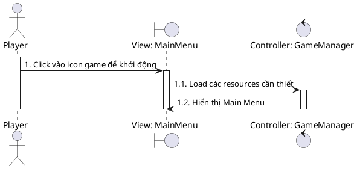
**Ưu điểm:** Rõ ràng về trách nhiệm, Controller orchestrate toàn bộ flow

### Cách 2: Unity Component-Based (View tự xử lý lifecycle)
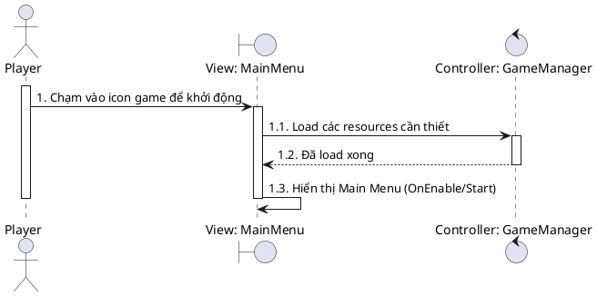
**Ưu điểm:** Phản ánh đúng Unity MonoBehaviour lifecycle (Awake → OnEnable → Start)

---

## 2. Settings - Điều chỉnh Audio (UC02)
> **Lưu ý:** Settings tự hiển thị slider (bước 2.1) là hợp lý vì phản ánh Unity UI component tự render khi được kích hoạt

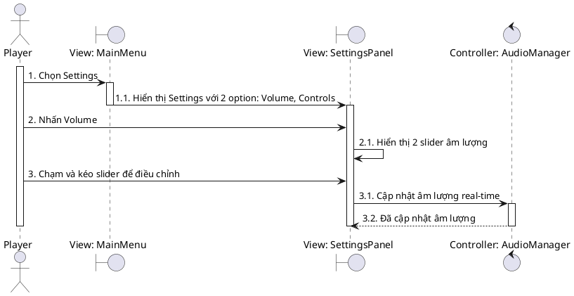

---

## 3. Settings - Điều chỉnh Controls (UC03)
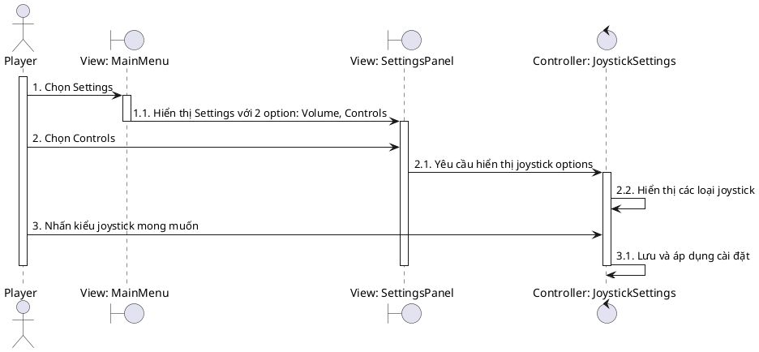

---

## 4. Settings - Tùy chỉnh UI Layout (UC04)
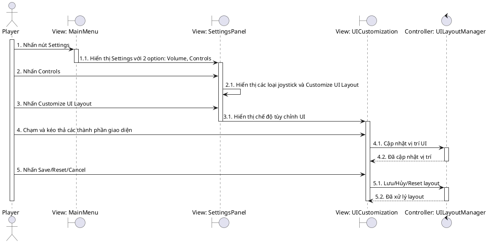

---

## 5. Chọn nhân vật và xem thông tin (UC06)

### Cách 1: Unity-Style (View tự hiển thị sau khi nhận dữ liệu)
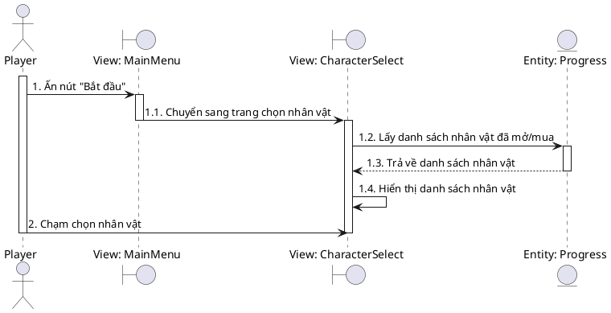
**Ưu điểm:** CharacterSelect tự quản lý UI rendering sau khi có data

### Cách 2: MVC Pattern (Controller điều khiển)
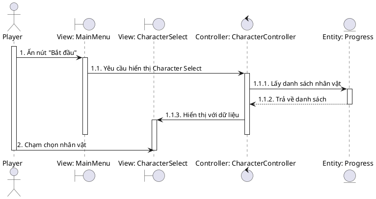
**Ưu điểm:** Tách biệt rõ ràng giữa logic và presentation

---

## 6. Mua/Mở khóa nhân vật (UC07)
> **Lưu ý:** Button "Buy" chỉ active khi đủ coins, nếu không đủ thì button bị disable

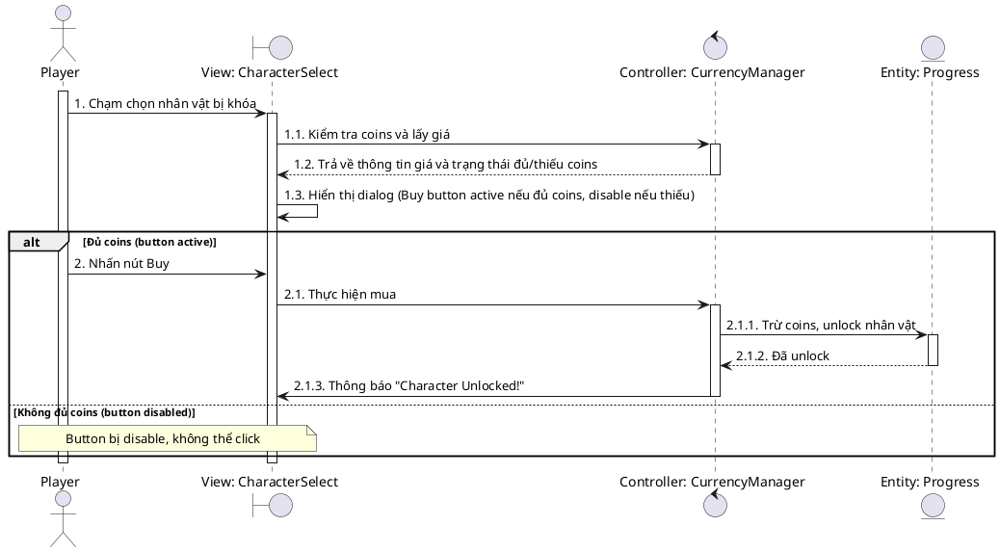

---

## 7. Chọn map để chơi (UC08)
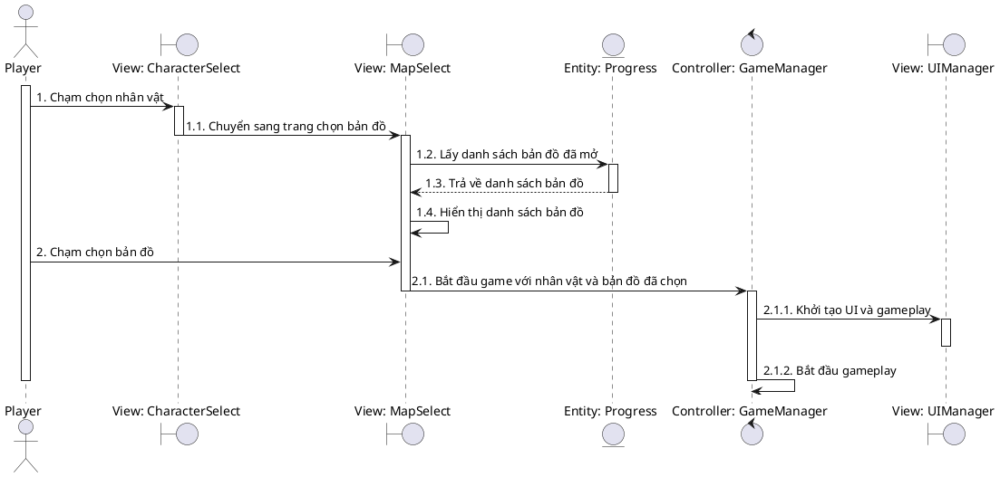

---

## 8. Di chuyển nhân vật (UC09)
> **Lưu ý:** Game mobile sử dụng virtual joystick trên màn hình

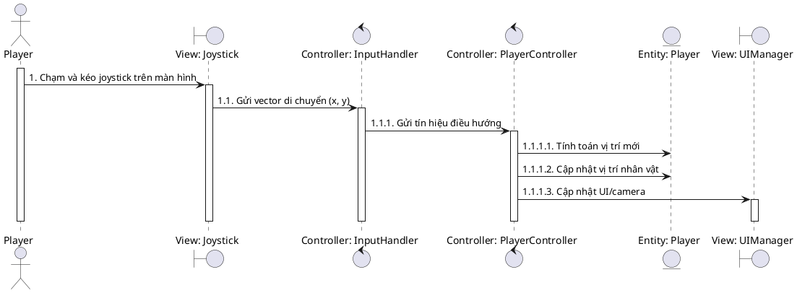

---

## 9. Tạm dừng game (UC10)

### Cách 1: MVC Pattern (Controller điều khiển)
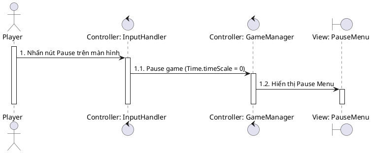

### Cách 2: Unity-Style (PauseMenu tự hiển thị)
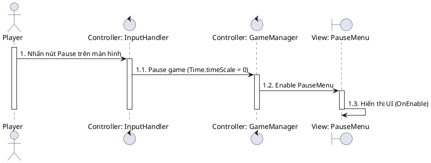
**Ưu điểm Cách 2:** PauseMenu component tự xử lý animation, layout khi được enable

---

## 10. Tiếp tục game (UC11)
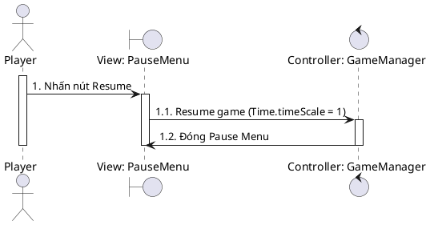

---

## 11. Thoát về menu (UC12, UC05)
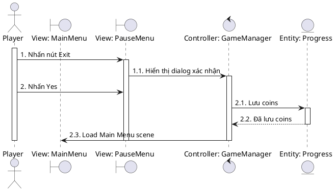

---

## 12. Chọn upgrade khi level up (UC13)
> **Lưu ý:** UpgradePanel tự hiển thị UI (1.1.4) phản ánh Unity UI tự render sau khi nhận data từ Controller

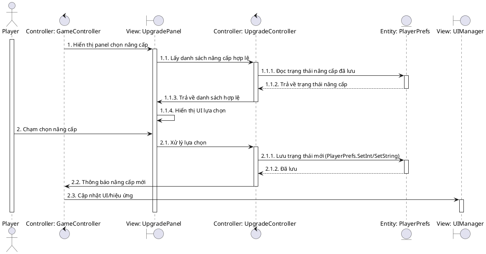

---

## 13. Xem Achievements (UC14)
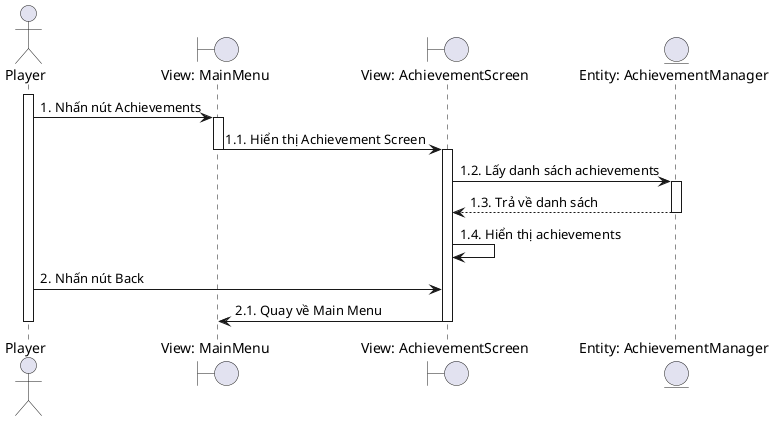

---

## 14. Xem Collection (UC15)
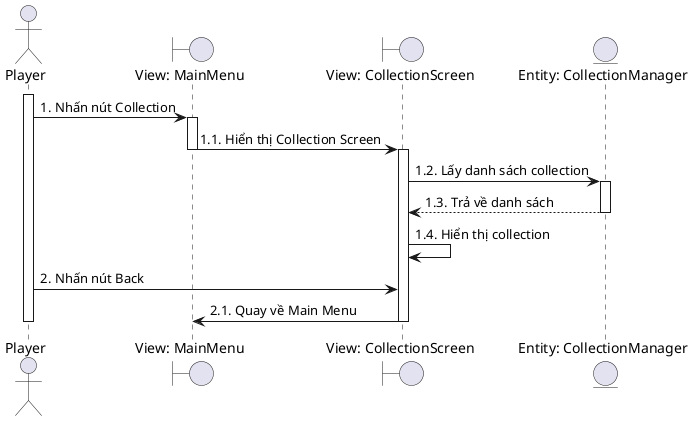

---

## 15. Restart game sau khi kết thúc (UC16)

### Cách 1: Unity-Style (GameOverDialog tự hiển thị)
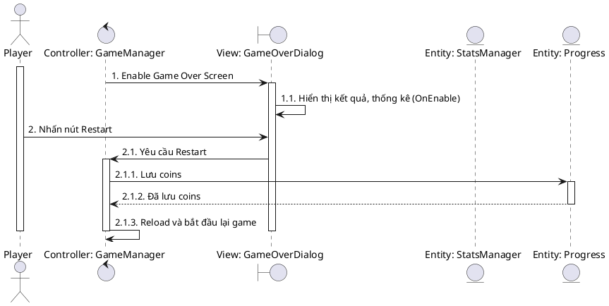
**Ưu điểm:** GameOverDialog tự load stats và hiển thị khi được enable

### Cách 2: MVC Pattern
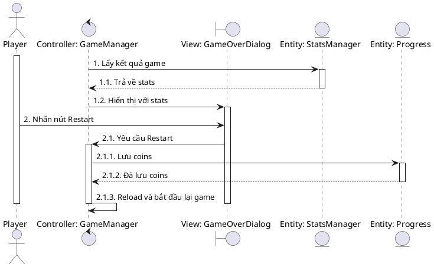
**Ưu điểm:** GameManager điều khiển toàn bộ flow, tách biệt data và view

---

## 16. Quay về Main Menu sau khi kết thúc game (UC17)
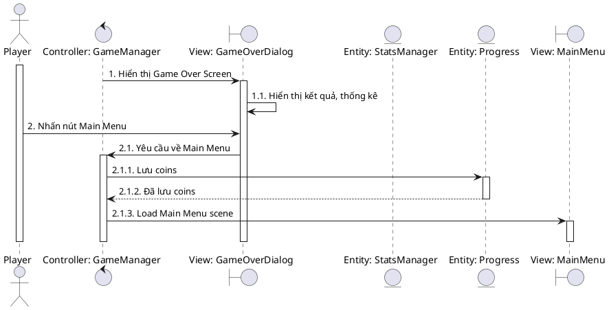

---

> **Lưu ý:**
> - Đã bổ sung các chi tiết actor, View/Controller/Entity, numbering, alt block, các bước xác nhận, trả về dữ liệu, hiển thị UI, ...
> - Nếu cần thêm chi tiết cho từng sơ đồ, chỉ cần chỉnh sửa trực tiếp trong file này.
